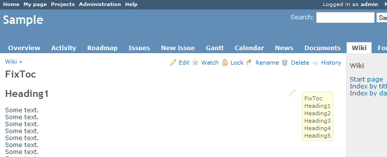
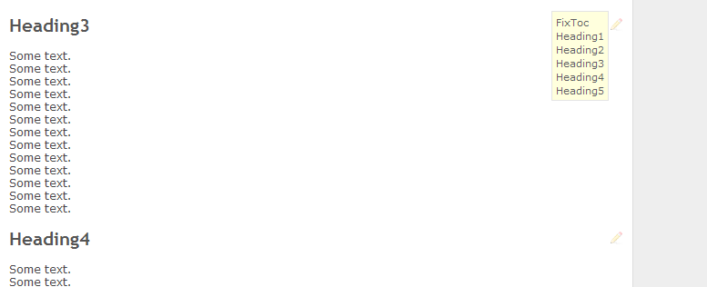

# Redmine wiki fix TOC position plugin

## Features

### Keep the position of {{>toc}} in the viewport.

* You can place it your favorite position, If fixed toc has had over the wiki content.

Scroll down to bottom...

## Requirement

* Redmine 3.0.0 or later.
* ruby 2.2

## Getting the plugin

https://github.com/tckz/redmine_wiki_fix_toc

e.g.)  
git clone git://github.com/tckz/redmine_wiki_fix_toc.git

## Install

1. Copy the plugin tree into #{RAILS_ROOT}/plugins/  

        e.g.)
        #{RAILS_ROOT}/plugins/
            redmine_wiki_fix_toc/

2. Restart Redmine.
    
## License

This plugin is licensed under the GNU GPL v2.  
See COPYRIGHT.txt and GPL.txt for details.

## My environment

* Based on docker image: redmine:5  
  https://hub.docker.com/_/redmine/
  * ruby-3.1.2p20
  * redmine-5.0.2
